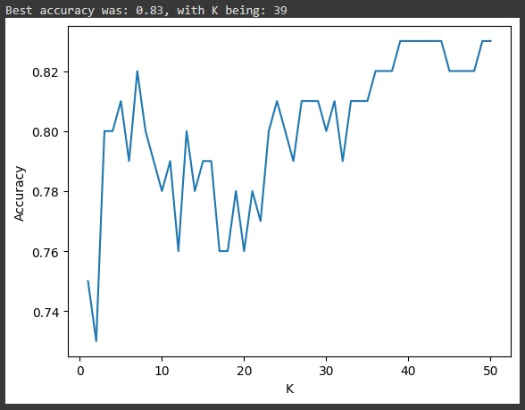

# K-NN_Spaceship_Titanic_Predictions
One of university machine learning projects where we predict the possibility of a passenger surviving.

We have a dataset from a spaceship called Titanic which unfortunately crashed as it's predecessor. 
Our goal is to make a model which could predict if a passenger is likely to survive based on the
data provided. 

This is what our data looks like. The column that we want to predict is Transported.

We used the K-NN algorithm for this assignment. You can find the full specification
of the project in the "ML D1 2023.pdf" file. This algorigthm refers to the 3rd exercise only (3a,3b,3c).
To run this you can open the "k_NN.ipynb" in google colab, don't forget to upload in "spaceship-titanic.csv"
in the files folder in google colab as well. The project is briefly explained in the file itself, and there
are visualizations of the data as well.

These are our predictions based solely on RoomService and FoodCort:

This is how our accuracy depends on various K parameters with only RoomService and FoodCourt as our features: 

If we add all the features into training this is how our new diagram looks like: 

